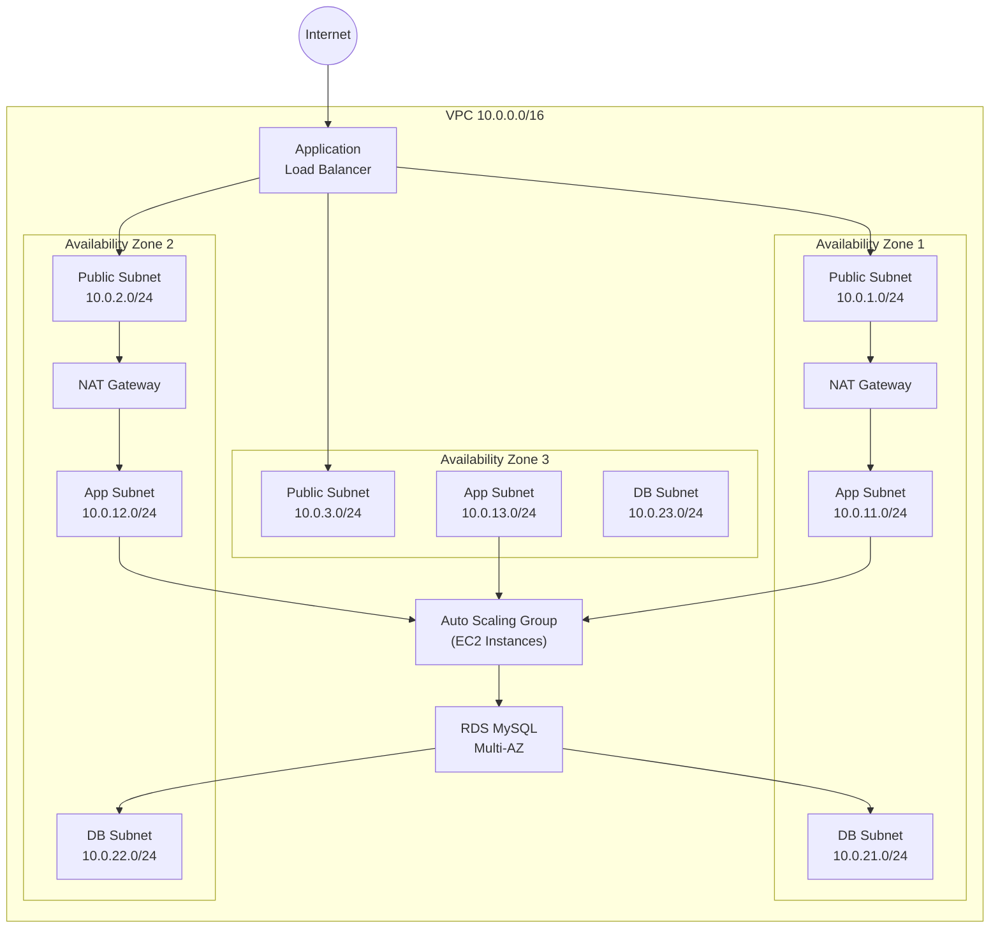
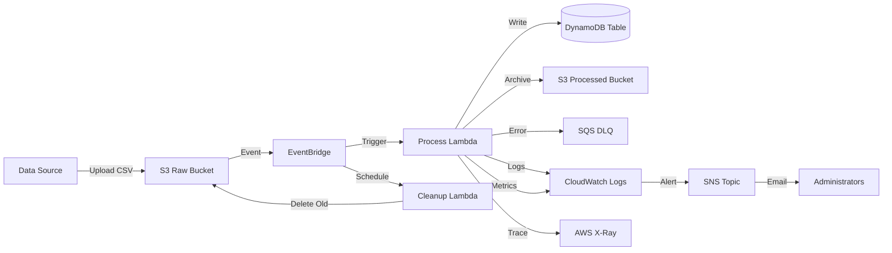

# Chapter 18: Real-World Production Projects

## Introduction

Reading about Terraform concepts—modules, state management, security best practices—builds theoretical understanding, but production expertise comes from hands-on experience navigating the messy reality where nothing works on the first try, documentation contradicts implementation, and integration challenges surface only after deployment. You've learned individual Terraform features chapter by chapter, but real projects demand synthesizing dozens of concepts simultaneously: How do you architect a three-tier web application where the load balancer, auto-scaling group, and RDS database all depend on each other with proper security isolation? How do you build a serverless data pipeline where S3 events trigger Lambda functions that write to DynamoDB with error handling, monitoring, and cost optimization? How do you deploy a production-ready Kubernetes cluster on EKS with 15 add-ons, OIDC authentication, cluster auto-scaling, and multi-AZ resilience? These questions have no simple answers—they require making architectural trade-offs, debugging cryptic errors, and iteratively refining configurations until everything works together reliably.

This chapter bridges the gap between knowing Terraform syntax and delivering production infrastructure through five comprehensive real-world projects. Each project walks you through complete end-to-end implementations that mirror actual enterprise deployments: a three-tier web application with VPC isolation, load balancing, and RDS databases; a serverless data processing pipeline using Lambda, S3, DynamoDB, and EventBridge; a multi-region disaster recovery setup with automatic failover and data replication; a production-grade EKS Kubernetes cluster with essential add-ons and monitoring; and an enterprise multi-account AWS Organization with automated account provisioning and centralized governance. Unlike typical tutorials showing simplified "hello world" examples, these projects include the complexity, trade-offs, and troubleshooting steps you'll encounter in real-world scenarios—DNS configuration issues, IAM permission errors, state locking problems, circular dependencies, and cost optimization challenges that only reveal themselves during actual deployment.

Each project follows a consistent structure making them practical learning tools: clear architecture diagrams showing all AWS components and their relationships; complete, tested Terraform code organized into logical modules following best practices; step-by-step deployment instructions with expected outputs at each stage; validation procedures confirming everything works correctly; common troubleshooting scenarios with solutions; cost breakdowns helping you understand monthly expenses; and security considerations addressing compliance requirements. You can deploy these projects in your AWS account (with appropriate cost awareness), modify them for your specific needs, or study the patterns and apply them to your own infrastructure challenges. By the end of this chapter, you'll have hands-on experience with complex production patterns, confidence deploying multi-component architectures, and a reference library of working code you can adapt for future projects.

## Project 1: Multi-Tier Web Application Infrastructure

### Architecture Overview

**Components:**

- **Web Tier:** Application Load Balancer (ALB) in public subnets distributing traffic
- **Application Tier:** Auto Scaling Group with EC2 instances in private subnets
- **Database Tier:** RDS MySQL Multi-AZ in isolated database subnets
- **Networking:** VPC with 3 AZs, public/private/database subnets, NAT Gateways
- **Security:** Security Groups, NACLs, IAM roles with least privilege
- **Monitoring:** CloudWatch dashboards, alarms, log aggregation

**Architecture Diagram (Mermaid):**




### Project Structure

```
three-tier-app/
├── README.md
├── terraform.tfvars
├── backend.tf
├── provider.tf
├── main.tf
├── variables.tf
├── outputs.tf
├── modules/
│   ├── networking/
│   │   ├── main.tf
│   │   ├── variables.tf
│   │   └── outputs.tf
│   ├── security-groups/
│   │   ├── main.tf
│   │   ├── variables.tf
│   │   └── outputs.tf
│   ├── compute/
│   │   ├── main.tf
│   │   ├── variables.tf
│   │   └── outputs.tf
│   └── database/
│       ├── main.tf
│       ├── variables.tf
│       └── outputs.tf
└── scripts/
    ├── user-data.sh
    └── db-init.sql
```


### Complete Implementation

**Root Module Configuration:**

```hcl
# provider.tf
terraform {
  required_version = ">= 1.11.0"
  
  required_providers {
    aws = {
      source  = "hashicorp/aws"
      version = "~> 6.0"
    }
    random = {
      source  = "hashicorp/random"
      version = "~> 3.6"
    }
  }
}

provider "aws" {
  region = var.aws_region
  
  default_tags {
    tags = {
      Project     = var.project_name
      Environment = var.environment
      ManagedBy   = "Terraform"
      CostCenter  = "Engineering"
    }
  }
}

# backend.tf
terraform {
  backend "s3" {
    bucket         = "three-tier-app-terraform-state"
    key            = "production/terraform.tfstate"
    region         = "us-east-1"
    encrypt        = true
    dynamodb_table = "terraform-state-locks"
  }
}

# variables.tf
variable "aws_region" {
  description = "AWS region to deploy resources"
  type        = string
  default     = "us-east-1"
}

variable "project_name" {
  description = "Project name for resource naming"
  type        = string
  default     = "three-tier-app"
}

variable "environment" {
  description = "Environment name"
  type        = string
  default     = "production"
}

variable "vpc_cidr" {
  description = "CIDR block for VPC"
  type        = string
  default     = "10.0.0.0/16"
}

variable "availability_zones" {
  description = "Availability zones to use"
  type        = list(string)
  default     = ["us-east-1a", "us-east-1b", "us-east-1c"]
}

variable "instance_type" {
  description = "EC2 instance type for application servers"
  type        = string
  default     = "t3.medium"
}

variable "min_size" {
  description = "Minimum number of instances in ASG"
  type        = number
  default     = 2
}

variable "max_size" {
  description = "Maximum number of instances in ASG"
  type        = number
  default     = 6
}

variable "desired_capacity" {
  description = "Desired number of instances in ASG"
  type        = number
  default     = 3
}

variable "db_instance_class" {
  description = "RDS instance class"
  type        = string
  default     = "db.t3.medium"
}

variable "db_allocated_storage" {
  description = "Allocated storage for RDS (GB)"
  type        = number
  default     = 100
}

variable "db_name" {
  description = "Database name"
  type        = string
  default     = "appdb"
}

variable "db_username" {
  description = "Database master username"
  type        = string
  default     = "admin"
  sensitive   = true
}

# main.tf
# Data sources
data "aws_ami" "amazon_linux_2" {
  most_recent = true
  owners      = ["amazon"]
  
  filter {
    name   = "name"
    values = ["amzn2-ami-hvm-*-x86_64-gp2"]
  }
  
  filter {
    name   = "virtualization-type"
    values = ["hvm"]
  }
}

# Generate random password for database
resource "random_password" "db_password" {
  length  = 32
  special = true
}

# Store DB password in Secrets Manager
resource "aws_secretsmanager_secret" "db_password" {
  name                    = "${var.project_name}-${var.environment}-db-password"
  description             = "Database password for ${var.project_name}"
  recovery_window_in_days = 7
}

resource "aws_secretsmanager_secret_version" "db_password" {
  secret_id = aws_secretsmanager_secret.db_password.id
  secret_string = jsonencode({
    username = var.db_username
    password = random_password.db_password.result
    host     = module.database.db_instance_endpoint
    port     = 3306
    dbname   = var.db_name
  })
}

# Networking Module
module "networking" {
  source = "./modules/networking"
  
  project_name       = var.project_name
  environment        = var.environment
  vpc_cidr           = var.vpc_cidr
  availability_zones = var.availability_zones
}

# Security Groups Module
module "security_groups" {
  source = "./modules/security-groups"
  
  project_name = var.project_name
  environment  = var.environment
  vpc_id       = module.networking.vpc_id
  vpc_cidr     = var.vpc_cidr
}

# Compute Module (ALB + ASG)
module "compute" {
  source = "./modules/compute"
  
  project_name           = var.project_name
  environment            = var.environment
  vpc_id                 = module.networking.vpc_id
  public_subnet_ids      = module.networking.public_subnet_ids
  private_subnet_ids     = module.networking.private_subnet_ids
  alb_security_group_id  = module.security_groups.alb_security_group_id
  app_security_group_id  = module.security_groups.app_security_group_id
  ami_id                 = data.aws_ami.amazon_linux_2.id
  instance_type          = var.instance_type
  min_size               = var.min_size
  max_size               = var.max_size
  desired_capacity       = var.desired_capacity
  db_secret_arn          = aws_secretsmanager_secret.db_password.arn
}

# Database Module
module "database" {
  source = "./modules/database"
  
  project_name        = var.project_name
  environment         = var.environment
  vpc_id              = module.networking.vpc_id
  database_subnet_ids = module.networking.database_subnet_ids
  db_security_group_id = module.security_groups.db_security_group_id
  db_instance_class   = var.db_instance_class
  db_allocated_storage = var.db_allocated_storage
  db_name             = var.db_name
  db_username         = var.db_username
  db_password         = random_password.db_password.result
}

# outputs.tf
output "alb_dns_name" {
  description = "DNS name of the Application Load Balancer"
  value       = module.compute.alb_dns_name
}

output "alb_zone_id" {
  description = "Zone ID of the Application Load Balancer"
  value       = module.compute.alb_zone_id
}

output "db_instance_endpoint" {
  description = "RDS instance endpoint"
  value       = module.database.db_instance_endpoint
  sensitive   = true
}

output "db_secret_arn" {
  description = "ARN of the database credentials secret"
  value       = aws_secretsmanager_secret.db_password.arn
}

output "vpc_id" {
  description = "VPC ID"
  value       = module.networking.vpc_id
}

output "application_url" {
  description = "Application URL"
  value       = "http://${module.compute.alb_dns_name}"
}
```

**Networking Module:**

```hcl
# modules/networking/variables.tf
variable "project_name" {
  description = "Project name"
  type        = string
}

variable "environment" {
  description = "Environment name"
  type        = string
}

variable "vpc_cidr" {
  description = "VPC CIDR block"
  type        = string
}

variable "availability_zones" {
  description = "List of availability zones"
  type        = list(string)
}

# modules/networking/main.tf
locals {
  azs_count = length(var.availability_zones)
}

# VPC
resource "aws_vpc" "main" {
  cidr_block           = var.vpc_cidr
  enable_dns_hostnames = true
  enable_dns_support   = true
  
  tags = {
    Name = "${var.project_name}-${var.environment}-vpc"
  }
}

# Internet Gateway
resource "aws_internet_gateway" "main" {
  vpc_id = aws_vpc.main.id
  
  tags = {
    Name = "${var.project_name}-${var.environment}-igw"
  }
}

# Public Subnets
resource "aws_subnet" "public" {
  count = local.azs_count
  
  vpc_id                  = aws_vpc.main.id
  cidr_block              = cidrsubnet(var.vpc_cidr, 8, count.index)
  availability_zone       = var.availability_zones[count.index]
  map_public_ip_on_launch = true
  
  tags = {
    Name = "${var.project_name}-${var.environment}-public-subnet-${count.index + 1}"
    Tier = "Public"
  }
}

# Private Subnets (Application Tier)
resource "aws_subnet" "private" {
  count = local.azs_count
  
  vpc_id            = aws_vpc.main.id
  cidr_block        = cidrsubnet(var.vpc_cidr, 8, count.index + 10)
  availability_zone = var.availability_zones[count.index]
  
  tags = {
    Name = "${var.project_name}-${var.environment}-private-subnet-${count.index + 1}"
    Tier = "Private"
  }
}

# Database Subnets
resource "aws_subnet" "database" {
  count = local.azs_count
  
  vpc_id            = aws_vpc.main.id
  cidr_block        = cidrsubnet(var.vpc_cidr, 8, count.index + 20)
  availability_zone = var.availability_zones[count.index]
  
  tags = {
    Name = "${var.project_name}-${var.environment}-database-subnet-${count.index + 1}"
    Tier = "Database"
  }
}

# Elastic IPs for NAT Gateways
resource "aws_eip" "nat" {
  count  = 2  # Deploy NAT in first 2 AZs only (cost optimization)
  domain = "vpc"
  
  depends_on = [aws_internet_gateway.main]
  
  tags = {
    Name = "${var.project_name}-${var.environment}-nat-eip-${count.index + 1}"
  }
}

# NAT Gateways
resource "aws_nat_gateway" "main" {
  count = 2
  
  allocation_id = aws_eip.nat[count.index].id
  subnet_id     = aws_subnet.public[count.index].id
  
  tags = {
    Name = "${var.project_name}-${var.environment}-nat-${count.index + 1}"
  }
  
  depends_on = [aws_internet_gateway.main]
}

# Public Route Table
resource "aws_route_table" "public" {
  vpc_id = aws_vpc.main.id
  
  route {
    cidr_block = "0.0.0.0/0"
    gateway_id = aws_internet_gateway.main.id
  }
  
  tags = {
    Name = "${var.project_name}-${var.environment}-public-rt"
  }
}

# Public Subnet Route Table Associations
resource "aws_route_table_association" "public" {
  count = local.azs_count
  
  subnet_id      = aws_subnet.public[count.index].id
  route_table_id = aws_route_table.public.id
}

# Private Route Tables (one per NAT Gateway)
resource "aws_route_table" "private" {
  count = 2
  
  vpc_id = aws_vpc.main.id
  
  route {
    cidr_block     = "0.0.0.0/0"
    nat_gateway_id = aws_nat_gateway.main[count.index].id
  }
  
  tags = {
    Name = "${var.project_name}-${var.environment}-private-rt-${count.index + 1}"
  }
}

# Private Subnet Route Table Associations
resource "aws_route_table_association" "private" {
  count = local.azs_count
  
  subnet_id      = aws_subnet.private[count.index].id
  route_table_id = aws_route_table.private[count.index % 2].id  # Distribute across NAT GWs
}

# Database Route Table
resource "aws_route_table" "database" {
  vpc_id = aws_vpc.main.id
  
  tags = {
    Name = "${var.project_name}-${var.environment}-database-rt"
  }
}

# Database Subnet Route Table Associations
resource "aws_route_table_association" "database" {
  count = local.azs_count
  
  subnet_id      = aws_subnet.database[count.index].id
  route_table_id = aws_route_table.database.id
}

# VPC Flow Logs
resource "aws_cloudwatch_log_group" "vpc_flow_logs" {
  name              = "/aws/vpc/${var.project_name}-${var.environment}-flow-logs"
  retention_in_days = 30
}

resource "aws_iam_role" "vpc_flow_logs" {
  name = "${var.project_name}-${var.environment}-vpc-flow-logs-role"
  
  assume_role_policy = jsonencode({
    Version = "2012-10-17"
    Statement = [
      {
        Effect = "Allow"
        Principal = {
          Service = "vpc-flow-logs.amazonaws.com"
        }
        Action = "sts:AssumeRole"
      }
    ]
  })
}

resource "aws_iam_role_policy" "vpc_flow_logs" {
  name = "vpc-flow-logs-policy"
  role = aws_iam_role.vpc_flow_logs.id
  
  policy = jsonencode({
    Version = "2012-10-17"
    Statement = [
      {
        Effect = "Allow"
        Action = [
          "logs:CreateLogGroup",
          "logs:CreateLogStream",
          "logs:PutLogEvents",
          "logs:DescribeLogGroups",
          "logs:DescribeLogStreams"
        ]
        Resource = "*"
      }
    ]
  })
}

resource "aws_flow_log" "main" {
  iam_role_arn    = aws_iam_role.vpc_flow_logs.arn
  log_destination = aws_cloudwatch_log_group.vpc_flow_logs.arn
  traffic_type    = "ALL"
  vpc_id          = aws_vpc.main.id
}

# modules/networking/outputs.tf
output "vpc_id" {
  description = "VPC ID"
  value       = aws_vpc.main.id
}

output "public_subnet_ids" {
  description = "Public subnet IDs"
  value       = aws_subnet.public[*].id
}

output "private_subnet_ids" {
  description = "Private subnet IDs"
  value       = aws_subnet.private[*].id
}

output "database_subnet_ids" {
  description = "Database subnet IDs"
  value       = aws_subnet.database[*].id
}

output "nat_gateway_ips" {
  description = "NAT Gateway public IPs"
  value       = aws_eip.nat[*].public_ip
}
```

**Security Groups Module:**

```hcl
# modules/security-groups/main.tf

# ALB Security Group
resource "aws_security_group" "alb" {
  name        = "${var.project_name}-${var.environment}-alb-sg"
  description = "Security group for Application Load Balancer"
  vpc_id      = var.vpc_id
  
  tags = {
    Name = "${var.project_name}-${var.environment}-alb-sg"
  }
}

resource "aws_vpc_security_group_ingress_rule" "alb_http" {
  security_group_id = aws_security_group.alb.id
  
  from_port   = 80
  to_port     = 80
  ip_protocol = "tcp"
  cidr_ipv4   = "0.0.0.0/0"
  description = "HTTP from internet"
}

resource "aws_vpc_security_group_ingress_rule" "alb_https" {
  security_group_id = aws_security_group.alb.id
  
  from_port   = 443
  to_port     = 443
  ip_protocol = "tcp"
  cidr_ipv4   = "0.0.0.0/0"
  description = "HTTPS from internet"
}

resource "aws_vpc_security_group_egress_rule" "alb_to_app" {
  security_group_id = aws_security_group.alb.id
  
  from_port                    = 80
  to_port                      = 80
  ip_protocol                  = "tcp"
  referenced_security_group_id = aws_security_group.app.id
  description                  = "To application tier"
}

# Application Tier Security Group
resource "aws_security_group" "app" {
  name        = "${var.project_name}-${var.environment}-app-sg"
  description = "Security group for application servers"
  vpc_id      = var.vpc_id
  
  tags = {
    Name = "${var.project_name}-${var.environment}-app-sg"
  }
}

resource "aws_vpc_security_group_ingress_rule" "app_from_alb" {
  security_group_id = aws_security_group.app.id
  
  from_port                    = 80
  to_port                      = 80
  ip_protocol                  = "tcp"
  referenced_security_group_id = aws_security_group.alb.id
  description                  = "HTTP from ALB"
}

resource "aws_vpc_security_group_egress_rule" "app_to_db" {
  security_group_id = aws_security_group.app.id
  
  from_port                    = 3306
  to_port                      = 3306
  ip_protocol                  = "tcp"
  referenced_security_group_id = aws_security_group.db.id
  description                  = "MySQL to database"
}

resource "aws_vpc_security_group_egress_rule" "app_to_internet" {
  security_group_id = aws_security_group.app.id
  
  ip_protocol = "-1"
  cidr_ipv4   = "0.0.0.0/0"
  description = "All traffic to internet"
}

# Database Security Group
resource "aws_security_group" "db" {
  name        = "${var.project_name}-${var.environment}-db-sg"
  description = "Security group for RDS database"
  vpc_id      = var.vpc_id
  
  tags = {
    Name = "${var.project_name}-${var.environment}-db-sg"
  }
}

resource "aws_vpc_security_group_ingress_rule" "db_from_app" {
  security_group_id = aws_security_group.db.id
  
  from_port                    = 3306
  to_port                      = 3306
  ip_protocol                  = "tcp"
  referenced_security_group_id = aws_security_group.app.id
  description                  = "MySQL from application tier"
}

# outputs
output "alb_security_group_id" {
  value = aws_security_group.alb.id
}

output "app_security_group_id" {
  value = aws_security_group.app.id
}

output "db_security_group_id" {
  value = aws_security_group.db.id
}
```

**Compute Module:**

```hcl
# modules/compute/main.tf

# Application Load Balancer
resource "aws_lb" "main" {
  name               = "${var.project_name}-${var.environment}-alb"
  internal           = false
  load_balancer_type = "application"
  security_groups    = [var.alb_security_group_id]
  subnets            = var.public_subnet_ids
  
  enable_deletion_protection = var.environment == "production" ? true : false
  enable_http2               = true
  enable_cross_zone_load_balancing = true
  
  tags = {
    Name = "${var.project_name}-${var.environment}-alb"
  }
}

# Target Group
resource "aws_lb_target_group" "app" {
  name     = "${var.project_name}-${var.environment}-tg"
  port     = 80
  protocol = "HTTP"
  vpc_id   = var.vpc_id
  
  health_check {
    enabled             = true
    healthy_threshold   = 2
    interval            = 30
    matcher             = "200"
    path                = "/"
    port                = "traffic-port"
    protocol            = "HTTP"
    timeout             = 5
    unhealthy_threshold = 3
  }
  
  deregistration_delay = 30
  
  stickiness {
    type            = "lb_cookie"
    cookie_duration = 86400
    enabled         = true
  }
  
  tags = {
    Name = "${var.project_name}-${var.environment}-tg"
  }
}

# ALB Listener
resource "aws_lb_listener" "http" {
  load_balancer_arn = aws_lb.main.arn
  port              = 80
  protocol          = "HTTP"
  
  default_action {
    type             = "forward"
    target_group_arn = aws_lb_target_group.app.arn
  }
}

# IAM Role for EC2 instances
resource "aws_iam_role" "app_instance" {
  name = "${var.project_name}-${var.environment}-app-instance-role"
  
  assume_role_policy = jsonencode({
    Version = "2012-10-17"
    Statement = [
      {
        Effect = "Allow"
        Principal = {
          Service = "ec2.amazonaws.com"
        }
        Action = "sts:AssumeRole"
      }
    ]
  })
}

resource "aws_iam_role_policy_attachment" "ssm_managed_instance" {
  role       = aws_iam_role.app_instance.name
  policy_arn = "arn:aws:iam::aws:policy/AmazonSSMManagedInstanceCore"
}

resource "aws_iam_role_policy" "secrets_access" {
  name = "secrets-access"
  role = aws_iam_role.app_instance.id
  
  policy = jsonencode({
    Version = "2012-10-17"
    Statement = [
      {
        Effect = "Allow"
        Action = [
          "secretsmanager:GetSecretValue"
        ]
        Resource = var.db_secret_arn
      }
    ]
  })
}

resource "aws_iam_instance_profile" "app_instance" {
  name = "${var.project_name}-${var.environment}-app-instance-profile"
  role = aws_iam_role.app_instance.name
}

# Launch Template
resource "aws_launch_template" "app" {
  name          = "${var.project_name}-${var.environment}-app-lt"
  image_id      = var.ami_id
  instance_type = var.instance_type
  
  iam_instance_profile {
    arn = aws_iam_instance_profile.app_instance.arn
  }
  
  vpc_security_group_ids = [var.app_security_group_id]
  
  user_data = base64encode(templatefile("${path.module}/../../scripts/user-data.sh", {
    db_secret_arn = var.db_secret_arn
    aws_region    = data.aws_region.current.name
  }))
  
  monitoring {
    enabled = true
  }
  
  metadata_options {
    http_endpoint               = "enabled"
    http_tokens                 = "required"  # IMDSv2
    http_put_response_hop_limit = 1
  }
  
  tag_specifications {
    resource_type = "instance"
    
    tags = {
      Name = "${var.project_name}-${var.environment}-app-instance"
    }
  }
}

# Auto Scaling Group
resource "aws_autoscaling_group" "app" {
  name                = "${var.project_name}-${var.environment}-asg"
  vpc_zone_identifier = var.private_subnet_ids
  target_group_arns   = [aws_lb_target_group.app.arn]
  health_check_type   = "ELB"
  health_check_grace_period = 300
  
  min_size         = var.min_size
  max_size         = var.max_size
  desired_capacity = var.desired_capacity
  
  launch_template {
    id      = aws_launch_template.app.id
    version = "$Latest"
  }
  
  tag {
    key                 = "Name"
    value               = "${var.project_name}-${var.environment}-app-instance"
    propagate_at_launch = true
  }
  
  lifecycle {
    create_before_destroy = true
  }
}

# Auto Scaling Policies
resource "aws_autoscaling_policy" "scale_up" {
  name                   = "${var.project_name}-${var.environment}-scale-up"
  scaling_adjustment     = 1
  adjustment_type        = "ChangeInCapacity"
  cooldown               = 300
  autoscaling_group_name = aws_autoscaling_group.app.name
}

resource "aws_autoscaling_policy" "scale_down" {
  name                   = "${var.project_name}-${var.environment}-scale-down"
  scaling_adjustment     = -1
  adjustment_type        = "ChangeInCapacity"
  cooldown               = 300
  autoscaling_group_name = aws_autoscaling_group.app.name
}

# CloudWatch Alarms
resource "aws_cloudwatch_metric_alarm" "cpu_high" {
  alarm_name          = "${var.project_name}-${var.environment}-cpu-high"
  comparison_operator = "GreaterThanThreshold"
  evaluation_periods  = 2
  metric_name         = "CPUUtilization"
  namespace           = "AWS/EC2"
  period              = 120
  statistic           = "Average"
  threshold           = 70
  
  dimensions = {
    AutoScalingGroupName = aws_autoscaling_group.app.name
  }
  
  alarm_actions = [aws_autoscaling_policy.scale_up.arn]
}

resource "aws_cloudwatch_metric_alarm" "cpu_low" {
  alarm_name          = "${var.project_name}-${var.environment}-cpu-low"
  comparison_operator = "LessThanThreshold"
  evaluation_periods  = 2
  metric_name         = "CPUUtilization"
  namespace           = "AWS/EC2"
  period              = 120
  statistic           = "Average"
  threshold           = 30
  
  dimensions = {
    AutoScalingGroupName = aws_autoscaling_group.app.name
  }
  
  alarm_actions = [aws_autoscaling_policy.scale_down.arn]
}

data "aws_region" "current" {}

# outputs
output "alb_dns_name" {
  value = aws_lb.main.dns_name
}

output "alb_zone_id" {
  value = aws_lb.main.zone_id
}

output "asg_name" {
  value = aws_autoscaling_group.app.name
}
```

**Database Module:**

```hcl
# modules/database/main.tf

# DB Subnet Group
resource "aws_db_subnet_group" "main" {
  name       = "${var.project_name}-${var.environment}-db-subnet-group"
  subnet_ids = var.database_subnet_ids
  
  tags = {
    Name = "${var.project_name}-${var.environment}-db-subnet-group"
  }
}

# DB Parameter Group
resource "aws_db_parameter_group" "main" {
  name   = "${var.project_name}-${var.environment}-db-params"
  family = "mysql8.0"
  
  parameter {
    name  = "character_set_server"
    value = "utf8mb4"
  }
  
  parameter {
    name  = "collation_server"
    value = "utf8mb4_unicode_ci"
  }
  
  parameter {
    name  = "max_connections"
    value = "500"
  }
  
  tags = {
    Name = "${var.project_name}-${var.environment}-db-params"
  }
}

# RDS Instance
resource "aws_db_instance" "main" {
  identifier     = "${var.project_name}-${var.environment}-db"
  engine         = "mysql"
  engine_version = "8.0.35"
  instance_class = var.db_instance_class
  
  allocated_storage     = var.db_allocated_storage
  max_allocated_storage = var.db_allocated_storage * 2
  storage_type          = "gp3"
  storage_encrypted     = true
  
  db_name  = var.db_name
  username = var.db_username
  password = var.db_password
  
  db_subnet_group_name   = aws_db_subnet_group.main.name
  vpc_security_group_ids = [var.db_security_group_id]
  parameter_group_name   = aws_db_parameter_group.main.name
  
  multi_az               = true
  publicly_accessible    = false
  backup_retention_period = 7
  backup_window          = "03:00-04:00"
  maintenance_window     = "sun:04:00-sun:05:00"
  
  enabled_cloudwatch_logs_exports = ["error", "general", "slowquery"]
  
  deletion_protection = var.environment == "production" ? true : false
  skip_final_snapshot = var.environment != "production"
  final_snapshot_identifier = var.environment == "production" ? "${var.project_name}-${var.environment}-final-snapshot-${formatdate("YYYY-MM-DD-hhmm", timestamp())}" : null
  
  tags = {
    Name = "${var.project_name}-${var.environment}-db"
  }
  
  lifecycle {
    ignore_changes = [final_snapshot_identifier]
  }
}

# outputs
output "db_instance_endpoint" {
  value = aws_db_instance.main.endpoint
}

output "db_instance_arn" {
  value = aws_db_instance.main.arn
}
```

**User Data Script:**

```bash
#!/bin/bash
# scripts/user-data.sh

# Update system
yum update -y

# Install Apache and PHP
yum install -y httpd php php-mysqlnd

# Start Apache
systemctl start httpd
systemctl enable httpd

# Fetch DB credentials from Secrets Manager
aws secretsmanager get-secret-value \
  --secret-id ${db_secret_arn} \
  --region ${aws_region} \
  --query SecretString \
  --output text > /tmp/db-secret.json

DB_HOST=$(cat /tmp/db-secret.json | jq -r '.host')
DB_USER=$(cat /tmp/db-secret.json | jq -r '.username')
DB_PASS=$(cat /tmp/db-secret.json | jq -r '.password')
DB_NAME=$(cat /tmp/db-secret.json | jq -r '.dbname')

# Create PHP application
cat > /var/www/html/index.php <<'EOF'
<!DOCTYPE html>
<html>
<head>
    <title>Three-Tier Application</title>
    <style>
        body { font-family: Arial; margin: 40px; }
        .status { padding: 20px; border-radius: 5px; margin: 10px 0; }
        .success { background-color: #d4edda; border: 1px solid #c3e6cb; }
        .error { background-color: #f8d7da; border: 1px solid #f5c6cb; }
    </style>
</head>
<body>
    <h1>Three-Tier Application - Running!</h1>
    
    <?php
    $db_host = getenv('DB_HOST');
    $db_user = getenv('DB_USER');
    $db_pass = getenv('DB_PASS');
    $db_name = getenv('DB_NAME');
    
    $conn = new mysqli($db_host, $db_user, $db_pass, $db_name);
    
    if ($conn->connect_error) {
        echo '<div class="status error">Database connection failed: ' . $conn->connect_error . '</div>';
    } else {
        echo '<div class="status success">✓ Database connected successfully!</div>';
        
        $result = $conn->query("SELECT VERSION() as version");
        if ($result) {
            $row = $result->fetch_assoc();
            echo '<p>MySQL Version: ' . $row['version'] . '</p>';
        }
        
        $conn->close();
    }
    
    echo '<h3>Server Information:</h3>';
    echo '<p>Server: ' . $_SERVER['SERVER_ADDR'] . '</p>';
    echo '<p>Availability Zone: ' . file_get_contents('http://169.254.169.254/latest/meta-data/placement/availability-zone') . '</p>';
    ?>
</body>
</html>
EOF

# Set environment variables for Apache
cat >> /etc/environment <<EOF
DB_HOST=$DB_HOST
DB_USER=$DB_USER
DB_PASS=$DB_PASS
DB_NAME=$DB_NAME
EOF

# Restart Apache
systemctl restart httpd

# Clean up
rm -f /tmp/db-secret.json
```


### Deployment Instructions

**Step 1: Prerequisites**

```bash
# Verify AWS CLI configuration
aws sts get-caller-identity

# Create S3 bucket for state (if not exists)
aws s3 mb s3://three-tier-app-terraform-state --region us-east-1

# Create DynamoDB table for locking
aws dynamodb create-table \
  --table-name terraform-state-locks \
  --attribute-definitions AttributeName=LockID,AttributeType=S \
  --key-schema AttributeName=LockID,KeyType=HASH \
  --billing-mode PAY_PER_REQUEST \
  --region us-east-1
```

**Step 2: Initialize and Deploy**

```bash
# Clone/create project structure
mkdir three-tier-app && cd three-tier-app

# Initialize Terraform
terraform init

# Validate configuration
terraform validate

# Format code
terraform fmt -recursive

# Review plan
terraform plan -out=tfplan

# Apply (deploy infrastructure)
terraform apply tfplan

# Expected output:
# ...
# Apply complete! Resources: 67 added, 0 changed, 0 destroyed.
# 
# Outputs:
# 
# alb_dns_name = "three-tier-app-production-alb-1234567890.us-east-1.elb.amazonaws.com"
# application_url = "http://three-tier-app-production-alb-1234567890.us-east-1.elb.amazonaws.com"
# vpc_id = "vpc-0123456789abcdef0"
```

**Step 3: Validation**

```bash
# Get ALB DNS name
ALB_DNS=$(terraform output -raw alb_dns_name)

# Wait for instances to be healthy (5-10 minutes)
watch -n 10 "aws elbv2 describe-target-health \
  --target-group-arn \$(terraform output -json | jq -r '.target_group_arn.value') \
  --query 'TargetHealthDescriptions[*].TargetHealth.State'"

# Test application
curl http://$ALB_DNS/

# Expected output:
# <!DOCTYPE html>
# <html>
# ...
# ✓ Database connected successfully!
# ...

# Load test (optional - generates traffic for auto-scaling)
ab -n 10000 -c 100 http://$ALB_DNS/
```

**Step 4: Monitor Resources**

```bash
# Check Auto Scaling Group status
aws autoscaling describe-auto-scaling-groups \
  --auto-scaling-group-names three-tier-app-production-asg \
  --query 'AutoScalingGroups[^0].{Desired:DesiredCapacity,Current:Instances[?HealthStatus==`Healthy`] | length(@)}'

# Check RDS status
aws rds describe-db-instances \
  --db-instance-identifier three-tier-app-production-db \
  --query 'DBInstances[^0].DBInstanceStatus'

# View CloudWatch metrics
aws cloudwatch get-metric-statistics \
  --namespace AWS/ApplicationELB \
  --metric-name TargetResponseTime \
  --dimensions Name=LoadBalancer,Value=app/three-tier-app-production-alb/... \
  --start-time $(date -u -d '1 hour ago' +%Y-%m-%dT%H:%M:%S) \
  --end-time $(date -u +%Y-%m-%dT%H:%M:%S) \
  --period 300 \
  --statistics Average
```


### Cost Breakdown

| Resource | Configuration | Monthly Cost (Estimate) |
| :-- | :-- | :-- |
| EC2 Instances (3x t3.medium) | On-Demand | ~\$88.32 |
| NAT Gateways (2x) | \$0.045/hour + data | ~\$67.50 |
| Application Load Balancer | \$0.0225/hour + LCU | ~\$20.00 |
| RDS MySQL (db.t3.medium, Multi-AZ) | 100 GB storage | ~\$160.00 |
| Data Transfer | Estimate 500 GB/month | ~\$45.00 |
| CloudWatch Logs | 10 GB/month | ~\$5.00 |
| **Total Estimated Monthly Cost** |  | **~\$385.82** |

**Cost Optimization Tips:**

- Use Reserved Instances for 40% savings on EC2 and RDS
- Switch to t3.small instances in non-prod (saves ~\$30/month per instance)
- Use single NAT Gateway in non-prod (saves \$32.85/month)
- Implement auto-scaling to scale down during off-hours


### Troubleshooting

**Issue 1: Instances showing unhealthy in target group**

```bash
# Check security group rules
aws ec2 describe-security-groups \
  --group-ids $(terraform output -raw app_security_group_id) \
  --query 'SecurityGroups[^0].IpPermissions'

# Verify instance has connectivity to RDS
aws ssm start-session --target i-0123456789abcdef0
# Inside session:
mysql -h three-tier-app-production-db.xxx.us-east-1.rds.amazonaws.com -u admin -p
```

**Issue 2: Application can't connect to database**

```bash
# Verify Secrets Manager permissions
aws iam simulate-principal-policy \
  --policy-source-arn $(terraform output -raw app_instance_role_arn) \
  --action-names secretsmanager:GetSecretValue \
  --resource-arns $(terraform output -raw db_secret_arn)

# Check database security group allows traffic from app tier
aws ec2 describe-security-groups \
  --group-ids $(terraform output -raw db_security_group_id)

## Project 2: Serverless Data Processing Pipeline

### Architecture Overview

**Components:**

- **Ingestion:** S3 bucket for raw data uploads with event notifications
- **Processing:** Lambda functions triggered by S3 events for data transformation
- **Storage:** DynamoDB for processed records, S3 for archives
- **Orchestration:** EventBridge for scheduling and routing
- **Monitoring:** CloudWatch Logs, X-Ray tracing, SNS for alerts
- **Error Handling:** DLQ for failed messages, retry logic

**Architecture Diagram (Mermaid):**




### Complete Implementation

```hcl
# serverless-pipeline/main.tf
terraform {
  required_version = ">= 1.11.0"
  
  required_providers {
    aws = {
      source  = "hashicorp/aws"
      version = "~> 6.0"
    }
    archive = {
      source  = "hashicorp/archive"
      version = "~> 2.4"
    }
  }
}

provider "aws" {
  region = var.aws_region
  
  default_tags {
    tags = {
      Project     = "serverless-data-pipeline"
      Environment = var.environment
      ManagedBy   = "Terraform"
    }
  }
}

variable "aws_region" {
  description = "AWS region"
  type        = string
  default     = "us-east-1"
}

variable "environment" {
  description = "Environment name"
  type        = string
  default     = "production"
}

variable "alert_email" {
  description = "Email for alerts"
  type        = string
}

# S3 Buckets
resource "aws_s3_bucket" "raw_data" {
  bucket = "data-pipeline-raw-${data.aws_caller_identity.current.account_id}"
}

resource "aws_s3_bucket" "processed_data" {
  bucket = "data-pipeline-processed-${data.aws_caller_identity.current.account_id}"
}

resource "aws_s3_bucket_versioning" "raw_data" {
  bucket = aws_s3_bucket.raw_data.id
  
  versioning_configuration {
    status = "Enabled"
  }
}

resource "aws_s3_bucket_lifecycle_configuration" "raw_data" {
  bucket = aws_s3_bucket.raw_data.id
  
  rule {
    id     = "delete-old-files"
    status = "Enabled"
    
    expiration {
      days = 30
    }
    
    noncurrent_version_expiration {
      noncurrent_days = 7
    }
  }
}

resource "aws_s3_bucket_notification" "raw_data" {
  bucket      = aws_s3_bucket.raw_data.id
  eventbridge = true
}

# DynamoDB Table
resource "aws_dynamodb_table" "processed_records" {
  name           = "data-pipeline-records"
  billing_mode   = "PAY_PER_REQUEST"
  hash_key       = "recordId"
  range_key      = "timestamp"
  
  attribute {
    name = "recordId"
    type = "S"
  }
  
  attribute {
    name = "timestamp"
    type = "N"
  }
  
  attribute {
    name = "status"
    type = "S"
  }
  
  global_secondary_index {
    name            = "StatusIndex"
    hash_key        = "status"
    range_key       = "timestamp"
    projection_type = "ALL"
  }
  
  point_in_time_recovery {
    enabled = true
  }
  
  stream_enabled   = true
  stream_view_type = "NEW_AND_OLD_IMAGES"
  
  tags = {
    Name = "data-pipeline-records"
  }
}

# SQS Dead Letter Queue
resource "aws_sqs_queue" "dlq" {
  name                      = "data-pipeline-dlq"
  message_retention_seconds = 1209600  # 14 days
  
  tags = {
    Name = "data-pipeline-dlq"
  }
}

# SNS Topic for Alerts
resource "aws_sns_topic" "alerts" {
  name = "data-pipeline-alerts"
}

resource "aws_sns_topic_subscription" "email" {
  topic_arn = aws_sns_topic.alerts.arn
  protocol  = "email"
  endpoint  = var.alert_email
}

# CloudWatch Log Groups
resource "aws_cloudwatch_log_group" "processor_lambda" {
  name              = "/aws/lambda/data-pipeline-processor"
  retention_in_days = 14
}

resource "aws_cloudwatch_log_group" "cleanup_lambda" {
  name              = "/aws/lambda/data-pipeline-cleanup"
  retention_in_days = 7
}

# IAM Role for Lambda Functions
resource "aws_iam_role" "lambda_execution" {
  name = "data-pipeline-lambda-execution-role"
  
  assume_role_policy = jsonencode({
    Version = "2012-10-17"
    Statement = [
      {
        Effect = "Allow"
        Principal = {
          Service = "lambda.amazonaws.com"
        }
        Action = "sts:AssumeRole"
      }
    ]
  })
}

resource "aws_iam_role_policy" "lambda_permissions" {
  name = "lambda-permissions"
  role = aws_iam_role.lambda_execution.id
  
  policy = jsonencode({
    Version = "2012-10-17"
    Statement = [
      {
        Effect = "Allow"
        Action = [
          "logs:CreateLogGroup",
          "logs:CreateLogStream",
          "logs:PutLogEvents"
        ]
        Resource = "arn:aws:logs:*:*:*"
      },
      {
        Effect = "Allow"
        Action = [
          "s3:GetObject",
          "s3:PutObject",
          "s3:DeleteObject"
        ]
        Resource = [
          "${aws_s3_bucket.raw_data.arn}/*",
          "${aws_s3_bucket.processed_data.arn}/*"
        ]
      },
      {
        Effect = "Allow"
        Action = [
          "s3:ListBucket"
        ]
        Resource = [
          aws_s3_bucket.raw_data.arn,
          aws_s3_bucket.processed_data.arn
        ]
      },
      {
        Effect = "Allow"
        Action = [
          "dynamodb:PutItem",
          "dynamodb:GetItem",
          "dynamodb:Query",
          "dynamodb:Scan",
          "dynamodb:UpdateItem"
        ]
        Resource = [
          aws_dynamodb_table.processed_records.arn,
          "${aws_dynamodb_table.processed_records.arn}/index/*"
        ]
      },
      {
        Effect = "Allow"
        Action = [
          "sqs:SendMessage"
        ]
        Resource = aws_sqs_queue.dlq.arn
      },
      {
        Effect = "Allow"
        Action = [
          "sns:Publish"
        ]
        Resource = aws_sns_topic.alerts.arn
      },
      {
        Effect = "Allow"
        Action = [
          "xray:PutTraceSegments",
          "xray:PutTelemetryRecords"
        ]
        Resource = "*"
      }
    ]
  })
}

# Lambda Function: Data Processor
data "archive_file" "processor_lambda" {
  type        = "zip"
  source_dir  = "${path.module}/lambda/processor"
  output_path = "${path.module}/builds/processor.zip"
}

resource "aws_lambda_function" "processor" {
  filename         = data.archive_file.processor_lambda.output_path
  function_name    = "data-pipeline-processor"
  role             = aws_iam_role.lambda_execution.arn
  handler          = "index.handler"
  runtime          = "python3.11"
  timeout          = 60
  memory_size      = 512
  source_code_hash = data.archive_file.processor_lambda.output_base64sha256
  
  environment {
    variables = {
      DYNAMODB_TABLE      = aws_dynamodb_table.processed_records.name
      PROCESSED_BUCKET    = aws_s3_bucket.processed_data.id
      DLQ_URL             = aws_sqs_queue.dlq.url
      SNS_TOPIC_ARN       = aws_sns_topic.alerts.arn
      ENVIRONMENT         = var.environment
    }
  }
  
  dead_letter_config {
    target_arn = aws_sqs_queue.dlq.arn
  }
  
  tracing_config {
    mode = "Active"
  }
  
  depends_on = [
    aws_cloudwatch_log_group.processor_lambda,
    aws_iam_role_policy.lambda_permissions
  ]
}

# Lambda Function: Cleanup
data "archive_file" "cleanup_lambda" {
  type        = "zip"
  source_dir  = "${path.module}/lambda/cleanup"
  output_path = "${path.module}/builds/cleanup.zip"
}

resource "aws_lambda_function" "cleanup" {
  filename         = data.archive_file.cleanup_lambda.output_path
  function_name    = "data-pipeline-cleanup"
  role             = aws_iam_role.lambda_execution.arn
  handler          = "index.handler"
  runtime          = "python3.11"
  timeout          = 300
  memory_size      = 256
  source_code_hash = data.archive_file.cleanup_lambda.output_base64sha256
  
  environment {
    variables = {
      RAW_BUCKET  = aws_s3_bucket.raw_data.id
      DAYS_TO_KEEP = "7"
    }
  }
  
  depends_on = [
    aws_cloudwatch_log_group.cleanup_lambda,
    aws_iam_role_policy.lambda_permissions
  ]
}

# EventBridge Rules
resource "aws_cloudwatch_event_rule" "s3_upload" {
  name        = "data-pipeline-s3-upload"
  description = "Trigger processing on S3 upload"
  
  event_pattern = jsonencode({
    source      = ["aws.s3"]
    detail-type = ["Object Created"]
    detail = {
      bucket = {
        name = [aws_s3_bucket.raw_data.id]
      }
      object = {
        key = [{
          suffix = ".csv"
        }]
      }
    }
  })
}

resource "aws_cloudwatch_event_target" "processor_lambda" {
  rule      = aws_cloudwatch_event_rule.s3_upload.name
  target_id = "ProcessorLambda"
  arn       = aws_lambda_function.processor.arn
  
  retry_policy {
    maximum_retry_attempts = 3
    maximum_event_age      = 3600
  }
}

resource "aws_lambda_permission" "eventbridge_processor" {
  statement_id  = "AllowEventBridgeInvoke"
  action        = "lambda:InvokeFunction"
  function_name = aws_lambda_function.processor.function_name
  principal     = "events.amazonaws.com"
  source_arn    = aws_cloudwatch_event_rule.s3_upload.arn
}

# Scheduled cleanup (daily at 2 AM)
resource "aws_cloudwatch_event_rule" "daily_cleanup" {
  name                = "data-pipeline-daily-cleanup"
  description         = "Clean up old files daily"
  schedule_expression = "cron(0 2 * * ? *)"
}

resource "aws_cloudwatch_event_target" "cleanup_lambda" {
  rule      = aws_cloudwatch_event_rule.daily_cleanup.name
  target_id = "CleanupLambda"
  arn       = aws_lambda_function.cleanup.arn
}

resource "aws_lambda_permission" "eventbridge_cleanup" {
  statement_id  = "AllowEventBridgeInvoke"
  action        = "lambda:InvokeFunction"
  function_name = aws_lambda_function.cleanup.function_name
  principal     = "events.amazonaws.com"
  source_arn    = aws_cloudwatch_event_rule.daily_cleanup.arn
}

# CloudWatch Alarms
resource "aws_cloudwatch_metric_alarm" "lambda_errors" {
  alarm_name          = "data-pipeline-lambda-errors"
  comparison_operator = "GreaterThanThreshold"
  evaluation_periods  = 1
  metric_name         = "Errors"
  namespace           = "AWS/Lambda"
  period              = 300
  statistic           = "Sum"
  threshold           = 5
  alarm_description   = "Alert when Lambda function errors exceed threshold"
  alarm_actions       = [aws_sns_topic.alerts.arn]
  
  dimensions = {
    FunctionName = aws_lambda_function.processor.function_name
  }
}

resource "aws_cloudwatch_metric_alarm" "dlq_messages" {
  alarm_name          = "data-pipeline-dlq-messages"
  comparison_operator = "GreaterThanThreshold"
  evaluation_periods  = 1
  metric_name         = "ApproximateNumberOfMessagesVisible"
  namespace           = "AWS/SQS"
  period              = 300
  statistic           = "Average"
  threshold           = 0
  alarm_description   = "Alert when messages appear in DLQ"
  alarm_actions       = [aws_sns_topic.alerts.arn]
  
  dimensions = {
    QueueName = aws_sqs_queue.dlq.name
  }
}

# Data sources
data "aws_caller_identity" "current" {}

# Outputs
output "raw_bucket_name" {
  description = "Name of raw data S3 bucket"
  value       = aws_s3_bucket.raw_data.id
}

output "processed_bucket_name" {
  description = "Name of processed data S3 bucket"
  value       = aws_s3_bucket.processed_data.id
}

output "dynamodb_table_name" {
  description = "Name of DynamoDB table"
  value       = aws_dynamodb_table.processed_records.name
}

output "processor_lambda_arn" {
  description = "ARN of processor Lambda function"
  value       = aws_lambda_function.processor.arn
}
```

**Lambda Function: Processor**

```python
# lambda/processor/index.py
import json
import boto3
import csv
import io
import uuid
from datetime import datetime
from aws_xray_sdk.core import xray_recorder
from aws_xray_sdk.core import patch_all

patch_all()

s3 = boto3.client('s3')
dynamodb = boto3.resource('dynamodb')
sqs = boto3.client('sqs')
sns = boto3.client('sns')

DYNAMODB_TABLE = os.environ['DYNAMODB_TABLE']
PROCESSED_BUCKET = os.environ['PROCESSED_BUCKET']
DLQ_URL = os.environ['DLQ_URL']
SNS_TOPIC_ARN = os.environ['SNS_TOPIC_ARN']

table = dynamodb.Table(DYNAMODB_TABLE)

@xray_recorder.capture('process_csv_file')
def handler(event, context):
    """
    Process CSV files uploaded to S3
    """
    print(f"Event: {json.dumps(event)}")
    
    try:
        # Extract S3 details from EventBridge event
        detail = event['detail']
        bucket_name = detail['bucket']['name']
        object_key = detail['object']['key']
        
        print(f"Processing file: s3://{bucket_name}/{object_key}")
        
        # Download file from S3
        response = s3.get_object(Bucket=bucket_name, Key=object_key)
        content = response['Body'].read().decode('utf-8')
        
        # Parse CSV
        csv_reader = csv.DictReader(io.StringIO(content))
        
        processed_records = []
        failed_records = []
        
        for row in csv_reader:
            try:
                # Validate and transform data
                record = process_record(row)
                
                # Write to DynamoDB
                table.put_item(Item=record)
                
                processed_records.append(record)
                
            except Exception as e:
                print(f"Error processing row: {str(e)}")
                failed_records.append({
                    'row': row,
                    'error': str(e)
                })
        
        # Archive processed file to processed bucket
        processed_key = f"processed/{datetime.now().strftime('%Y/%m/%d')}/{object_key}"
        s3.copy_object(
            CopySource={'Bucket': bucket_name, 'Key': object_key},
            Bucket=PROCESSED_BUCKET,
            Key=processed_key
        )
        
        # Send success notification
        summary = {
            'file': object_key,
            'processed': len(processed_records),
            'failed': len(failed_records),
            'timestamp': datetime.now().isoformat()
        }
        
        if failed_records:
            # Send failed records to DLQ
            sqs.send_message(
                QueueUrl=DLQ_URL,
                MessageBody=json.dumps({
                    'file': object_key,
                    'failed_records': failed_records
                })
            )
            
            # Send alert
            sns.publish(
                TopicArn=SNS_TOPIC_ARN,
                Subject='Data Pipeline: Partial Processing Failure',
                Message=json.dumps(summary, indent=2)
            )
        
        print(f"Processing complete: {summary}")
        
        return {
            'statusCode': 200,
            'body': json.dumps(summary)
        }
        
    except Exception as e:
        print(f"Fatal error: {str(e)}")
        
        # Send error to SNS
        sns.publish(
            TopicArn=SNS_TOPIC_ARN,
            Subject='Data Pipeline: Processing Failed',
            Message=f"Error processing {object_key}: {str(e)}"
        )
        
        raise

@xray_recorder.capture('process_record')
def process_record(row):
    """
    Validate and transform a single record
    """
    # Generate unique ID
    record_id = str(uuid.uuid4())
    
    # Validate required fields
    required_fields = ['name', 'email', 'amount']
    for field in required_fields:
        if field not in row or not row[field]:
            raise ValueError(f"Missing required field: {field}")
    
    # Transform data
    record = {
        'recordId': record_id,
        'timestamp': int(datetime.now().timestamp() * 1000),
        'name': row['name'].strip(),
        'email': row['email'].strip().lower(),
        'amount': float(row['amount']),
        'status': 'processed',
        'processedAt': datetime.now().isoformat()
    }
    
    # Add optional fields
    if 'category' in row:
        record['category'] = row['category']
    
    return record
```

**Lambda Function: Cleanup**

```python
# lambda/cleanup/index.py
import boto3
from datetime import datetime, timedelta
import os

s3 = boto3.client('s3')

RAW_BUCKET = os.environ['RAW_BUCKET']
DAYS_TO_KEEP = int(os.environ.get('DAYS_TO_KEEP', '7'))

def handler(event, context):
    """
    Clean up old files from raw bucket
    """
    print(f"Cleaning up files older than {DAYS_TO_KEEP} days from {RAW_BUCKET}")
    
    cutoff_date = datetime.now() - timedelta(days=DAYS_TO_KEEP)
    deleted_count = 0
    
    try:
        # List all objects
        paginator = s3.get_paginator('list_objects_v2')
        pages = paginator.paginate(Bucket=RAW_BUCKET)
        
        for page in pages:
            if 'Contents' not in page:
                continue
            
            for obj in page['Contents']:
                # Check if file is older than cutoff
                if obj['LastModified'].replace(tzinfo=None) < cutoff_date:
                    print(f"Deleting old file: {obj['Key']}")
                    
                    s3.delete_object(
                        Bucket=RAW_BUCKET,
                        Key=obj['Key']
                    )
                    
                    deleted_count += 1
        
        print(f"Cleanup complete. Deleted {deleted_count} files.")
        
        return {
            'statusCode': 200,
            'body': f"Deleted {deleted_count} files"
        }
        
    except Exception as e:
        print(f"Error during cleanup: {str(e)}")
        raise
```


### Deployment and Testing

```bash
# Deploy infrastructure
cd serverless-pipeline
terraform init
terraform apply -var="alert_email=your-email@example.com"

# Create test CSV file
cat > test-data.csv <<EOF
name,email,amount,category
John Doe,john@example.com,100.50,sales
Jane Smith,jane@example.com,250.75,marketing
Bob Johnson,bob@example.com,175.25,sales
EOF

# Upload to S3 (triggers processing)
aws s3 cp test-data.csv s3://$(terraform output -raw raw_bucket_name)/test-data.csv

# Monitor Lambda execution
aws logs tail /aws/lambda/data-pipeline-processor --follow

# Check DynamoDB for processed records
aws dynamodb scan --table-name data-pipeline-records --max-items 10

# Verify processed file
aws s3 ls s3://$(terraform output -raw processed_bucket_name)/processed/ --recursive

# Check CloudWatch metrics
aws cloudwatch get-metric-statistics \
  --namespace AWS/Lambda \
  --metric-name Invocations \
  --dimensions Name=FunctionName,Value=data-pipeline-processor \
  --start-time $(date -u -d '1 hour ago' +%Y-%m-%dT%H:%M:%S) \
  --end-time $(date -u +%Y-%m-%dT%H:%M:%S) \
  --period 300 \
  --statistics Sum
```

**Expected Monthly Cost:** ~\$15-30 (depending on usage)

- Lambda: \$0.20 per 1M requests + \$0.00001667/GB-second
- DynamoDB: Pay-per-request (minimal cost for testing)
- S3: \$0.023/GB storage + requests
- EventBridge: Free for AWS sources


## Project 3: Multi-Region Disaster Recovery Setup

### Architecture Overview

**Disaster Recovery Pattern:** Warm Standby
**RTO:** < 15 minutes | **RPO:** < 5 minutes

**Primary Region (us-east-1):**

- Full production infrastructure
- RDS with cross-region read replica
- Application servers with global accelerator

**Secondary Region (us-west-2):**

- Reduced capacity (warm standby)
- RDS read replica (can be promoted)
- Auto-scaling at minimum capacity

```hcl
# multi-region-dr/main.tf
terraform {
  required_version = ">= 1.11.0"
  
  required_providers {
    aws = {
      source  = "hashicorp/aws"
      version = "~> 6.0"
    }
  }
}

# Primary Region Provider
provider "aws" {
  alias  = "primary"
  region = var.primary_region
  
  default_tags {
    tags = {
      Project = "multi-region-dr"
      Region  = "primary"
    }
  }
}

# Secondary Region Provider
provider "aws" {
  alias  = "secondary"
  region = var.secondary_region
  
  default_tags {
    tags = {
      Project = "multi-region-dr"
      Region  = "secondary"
    }
  }
}

variable "primary_region" {
  description = "Primary AWS region"
  type        = string
  default     = "us-east-1"
}

variable "secondary_region" {
  description = "Secondary AWS region for DR"
  type        = string
  default     = "us-west-2"
}

variable "dr_mode" {
  description = "DR mode: warm_standby or active"
  type        = string
  default     = "warm_standby"
  
  validation {
    condition     = contains(["warm_standby", "active"], var.dr_mode)
    error_message = "DR mode must be warm_standby or active"
  }
}

# Deploy infrastructure in both regions
module "primary_region" {
  source = "./modules/regional-stack"
  
  providers = {
    aws = aws.primary
  }
  
  region              = var.primary_region
  is_primary          = true
  min_instances       = 3
  max_instances       = 10
  desired_capacity    = 5
  db_instance_class   = "db.r6g.xlarge"
  enable_multi_az     = true
}

module "secondary_region" {
  source = "./modules/regional-stack"
  
  providers = {
    aws = aws.secondary
  }
  
  region              = var.secondary_region
  is_primary          = false
  min_instances       = var.dr_mode == "warm_standby" ? 1 : 3
  max_instances       = 10
  desired_capacity    = var.dr_mode == "warm_standby" ? 1 : 5
  db_instance_class   = var.dr_mode == "warm_standby" ? "db.r6g.large" : "db.r6g.xlarge"
  enable_multi_az     = var.dr_mode == "active"
  
  primary_db_arn      = module.primary_region.db_instance_arn
}

# Global Accelerator for traffic distribution
resource "aws_globalaccelerator_accelerator" "main" {
  provider = aws.primary
  
  name            = "multi-region-dr-accelerator"
  ip_address_type = "IPV4"
  enabled         = true
  
  attributes {
    flow_logs_enabled   = true
    flow_logs_s3_bucket = aws_s3_bucket.flow_logs.id
    flow_logs_s3_prefix = "accelerator-logs/"
  }
}

resource "aws_s3_bucket" "flow_logs" {
  provider = aws.primary
  
  bucket = "multi-region-dr-flow-logs-${data.aws_caller_identity.current.account_id}"
}

resource "aws_globalaccelerator_listener" "https" {
  provider = aws.primary
  
  accelerator_arn = aws_globalaccelerator_accelerator.main.id
  protocol        = "TCP"
  
  port_range {
    from_port = 443
    to_port   = 443
  }
}

# Primary region endpoint group (100% traffic in normal operation)
resource "aws_globalaccelerator_endpoint_group" "primary" {
  provider = aws.primary
  
  listener_arn = aws_globalaccelerator_listener.https.id
  
  endpoint_group_region   = var.primary_region
  traffic_dial_percentage = 100
  health_check_interval_seconds = 30
  health_check_protocol   = "TCP"
  
  endpoint_configuration {
    endpoint_id = module.primary_region.alb_arn
    weight      = 100
  }
}

# Secondary region endpoint group (0% in warm standby, 100% in failover)
resource "aws_globalaccelerator_endpoint_group" "secondary" {
  provider = aws.primary
  
  listener_arn = aws_globalaccelerator_listener.https.id
  
  endpoint_group_region   = var.secondary_region
  traffic_dial_percentage = var.dr_mode == "warm_standby" ? 0 : 50
  health_check_interval_seconds = 30
  health_check_protocol   = "TCP"
  
  endpoint_configuration {
    endpoint_id = module.secondary_region.alb_arn
    weight      = 100
  }
}

# Route53 Health Checks
resource "aws_route53_health_check" "primary" {
  provider = aws.primary
  
  type              = "HTTPS"
  resource_path     = "/health"
  fqdn              = module.primary_region.alb_dns_name
  port              = 443
  request_interval  = 30
  failure_threshold = 3
  
  tags = {
    Name = "primary-region-health-check"
  }
}

resource "aws_route53_health_check" "secondary" {
  provider = aws.primary
  
  type              = "HTTPS"
  resource_path     = "/health"
  fqdn              = module.secondary_region.alb_dns_name
  port              = 443
  request_interval  = 30
  failure_threshold = 3
  
  tags = {
    Name = "secondary-region-health-check"
  }
}

# CloudWatch Alarms for failover automation
resource "aws_cloudwatch_metric_alarm" "primary_unhealthy" {
  provider = aws.primary
  
  alarm_name          = "primary-region-unhealthy"
  comparison_operator = "LessThanThreshold"
  evaluation_periods  = 2
  metric_name         = "HealthCheckStatus"
  namespace           = "AWS/Route53"
  period              = 60
  statistic           = "Minimum"
  threshold           = 1
  alarm_description   = "Primary region is unhealthy"
  alarm_actions       = [aws_sns_topic.dr_alerts.arn]
  
  dimensions = {
    HealthCheckId = aws_route53_health_check.primary.id
  }
}

# SNS topic for DR alerts
resource "aws_sns_topic" "dr_alerts" {
  provider = aws.primary
  
  name = "multi-region-dr-alerts"
}

resource "aws_sns_topic_subscription" "email" {
  provider = aws.primary
  
  topic_arn = aws_sns_topic.dr_alerts.arn
  protocol  = "email"
  endpoint  = var.alert_email
}

# Lambda for automated failover
resource "aws_lambda_function" "failover_automation" {
  provider = aws.primary
  
  filename      = "failover.zip"
  function_name = "dr-failover-automation"
  role          = aws_iam_role.failover_lambda.arn
  handler       = "index.handler"
  runtime       = "python3.11"
  timeout       = 300
  
  environment {
    variables = {
      SECONDARY_REGION_ASG = module.secondary_region.asg_name
      SECONDARY_DB_ID      = module.secondary_region.db_instance_id
      SNS_TOPIC_ARN        = aws_sns_topic.dr_alerts.arn
    }
  }
}

# Data sources
data "aws_caller_identity" "current" {
  provider = aws.primary
}

# Outputs
output "accelerator_dns_name" {
  description = "Global Accelerator DNS name"
  value       = aws_globalaccelerator_accelerator.main.dns_name
}

output "accelerator_static_ips" {
  description = "Global Accelerator static IPs"
  value       = aws_globalaccelerator_accelerator.main.ip_sets[0].ip_addresses
}

output "primary_region_alb" {
  description = "Primary region ALB DNS"
  value       = module.primary_region.alb_dns_name
}

output "secondary_region_alb" {
  description = "Secondary region ALB DNS"
  value       = module.secondary_region.alb_dns_name
}
```

**Failover Script:**

```bash
#!/bin/bash
# scripts/failover-to-secondary.sh

set -e

echo "==== INITIATING FAILOVER TO SECONDARY REGION ===="

# Step 1: Scale up secondary region
echo "Step 1: Scaling up secondary region ASG..."
aws autoscaling set-desired-capacity \
  --auto-scaling-group-name $(terraform output -raw secondary_asg_name) \
  --desired-capacity 5 \
  --region us-west-2

# Step 2: Promote RDS read replica
echo "Step 2: Promoting RDS read replica to primary..."
aws rds promote-read-replica \
  --db-instance-identifier $(terraform output -raw secondary_db_id) \
  --region us-west-2

# Step 3: Update Global Accelerator traffic dial
echo "Step 3: Redirecting traffic to secondary region..."
export TF_VAR_dr_mode="active"
terraform apply -target=aws_globalaccelerator_endpoint_group.secondary -auto-approve

# Step 4: Verify health
echo "Step 4: Verifying application health..."
sleep 60
SECONDARY_ALB=$(terraform output -raw secondary_region_alb)
curl -f https://$SECONDARY_ALB/health || { echo "Health check failed!"; exit 1; }

echo "==== FAILOVER COMPLETE ===="
echo "Application now running in secondary region"
echo "RTO achieved: ~10-15 minutes"

## Project 4: Production-Ready EKS Cluster with Add-ons

### Architecture Overview

**Components:**

- **EKS Control Plane:** Managed Kubernetes 1.31 with OIDC provider
- **Node Groups:** Managed node groups across 3 AZs with auto-scaling
- **Add-ons:** AWS Load Balancer Controller, Cluster Autoscaler, Metrics Server, External DNS
- **Storage:** EBS CSI Driver for persistent volumes
- **Networking:** VPC CNI, CoreDNS
- **Security:** Pod Security Standards, IAM roles for service accounts (IRSA)
- **Observability:** CloudWatch Container Insights, Fluent Bit

```hcl
# eks-cluster/main.tf
terraform {
  required_version = ">= 1.11.0"
  
  required_providers {
    aws = {
      source  = "hashicorp/aws"
      version = "~> 6.0"
    }
    kubernetes = {
      source  = "hashicorp/kubernetes"
      version = "~> 2.24"
    }
    helm = {
      source  = "hashicorp/helm"
      version = "~> 2.12"
    }
  }
}

provider "aws" {
  region = var.aws_region
}

# Configure Kubernetes provider after cluster creation
data "aws_eks_cluster" "cluster" {
  name = module.eks.cluster_name
}

data "aws_eks_cluster_auth" "cluster" {
  name = module.eks.cluster_name
}

provider "kubernetes" {
  host                   = data.aws_eks_cluster.cluster.endpoint
  cluster_ca_certificate = base64decode(data.aws_eks_cluster.cluster.certificate_authority[^0].data)
  token                  = data.aws_eks_cluster_auth.cluster.token
}

provider "helm" {
  kubernetes {
    host                   = data.aws_eks_cluster.cluster.endpoint
    cluster_ca_certificate = base64decode(data.aws_eks_cluster.cluster.certificate_authority[^0].data)
    token                  = data.aws_eks_cluster_auth.cluster.token
  }
}

variable "aws_region" {
  description = "AWS region"
  type        = string
  default     = "us-east-1"
}

variable "cluster_name" {
  description = "EKS cluster name"
  type        = string
  default     = "production-eks"
}

variable "cluster_version" {
  description = "Kubernetes version"
  type        = string
  default     = "1.31"
}

# VPC Module (reuse from Project 1 or use terraform-aws-modules/vpc/aws)
module "vpc" {
  source  = "terraform-aws-modules/vpc/aws"
  version = "~> 5.5"
  
  name = "${var.cluster_name}-vpc"
  cidr = "10.0.0.0/16"
  
  azs             = ["${var.aws_region}a", "${var.aws_region}b", "${var.aws_region}c"]
  private_subnets = ["10.0.1.0/24", "10.0.2.0/24", "10.0.3.0/24"]
  public_subnets  = ["10.0.101.0/24", "10.0.102.0/24", "10.0.103.0/24"]
  
  enable_nat_gateway   = true
  single_nat_gateway   = false  # One per AZ for HA
  enable_dns_hostnames = true
  enable_dns_support   = true
  
  # Tags required for EKS
  public_subnet_tags = {
    "kubernetes.io/role/elb"                    = "1"
    "kubernetes.io/cluster/${var.cluster_name}" = "shared"
  }
  
  private_subnet_tags = {
    "kubernetes.io/role/internal-elb"           = "1"
    "kubernetes.io/cluster/${var.cluster_name}" = "shared"
  }
  
  tags = {
    Environment = "production"
    ManagedBy   = "Terraform"
  }
}

# EKS Cluster
module "eks" {
  source  = "terraform-aws-modules/eks/aws"
  version = "~> 20.0"
  
  cluster_name    = var.cluster_name
  cluster_version = var.cluster_version
  
  cluster_endpoint_public_access  = true
  cluster_endpoint_private_access = true
  
  # Encryption
  cluster_encryption_config = {
    provider_key_arn = aws_kms_key.eks.arn
    resources        = ["secrets"]
  }
  
  vpc_id                   = module.vpc.vpc_id
  subnet_ids               = module.vpc.private_subnets
  control_plane_subnet_ids = module.vpc.private_subnets
  
  # Cluster access entry
  enable_cluster_creator_admin_permissions = true
  
  # Managed node groups
  eks_managed_node_groups = {
    general = {
      name           = "general-purpose"
      instance_types = ["t3.large"]
      
      min_size     = 2
      max_size     = 10
      desired_size = 3
      
      disk_size = 50
      
      labels = {
        role = "general"
      }
      
      tags = {
        NodeGroup = "general"
      }
    }
    
    spot = {
      name           = "spot-instances"
      instance_types = ["t3.large", "t3a.large"]
      capacity_type  = "SPOT"
      
      min_size     = 1
      max_size     = 5
      desired_size = 2
      
      disk_size = 50
      
      labels = {
        role = "spot"
      }
      
      taints = [
        {
          key    = "spot"
          value  = "true"
          effect = "NoSchedule"
        }
      ]
      
      tags = {
        NodeGroup = "spot"
      }
    }
  }
  
  # Cluster addons
  cluster_addons = {
    coredns = {
      most_recent = true
    }
    kube-proxy = {
      most_recent = true
    }
    vpc-cni = {
      most_recent              = true
      before_compute           = true
      service_account_role_arn = module.vpc_cni_irsa.iam_role_arn
      configuration_values = jsonencode({
        env = {
          ENABLE_PREFIX_DELEGATION = "true"
          ENABLE_POD_ENI           = "true"
        }
      })
    }
    aws-ebs-csi-driver = {
      most_recent              = true
      service_account_role_arn = module.ebs_csi_irsa.iam_role_arn
    }
  }
  
  # Enable IRSA
  enable_irsa = true
  
  tags = {
    Environment = "production"
    ManagedBy   = "Terraform"
  }
}

# KMS key for EKS encryption
resource "aws_kms_key" "eks" {
  description             = "EKS cluster encryption key"
  deletion_window_in_days = 7
  enable_key_rotation     = true
  
  tags = {
    Name = "${var.cluster_name}-eks-encryption"
  }
}

resource "aws_kms_alias" "eks" {
  name          = "alias/${var.cluster_name}-eks"
  target_key_id = aws_kms_key.eks.key_id
}

# IRSA for VPC CNI
module "vpc_cni_irsa" {
  source  = "terraform-aws-modules/iam/aws//modules/iam-role-for-service-accounts-eks"
  version = "~> 5.34"
  
  role_name_prefix      = "VPC-CNI-IRSA-"
  attach_vpc_cni_policy = true
  vpc_cni_enable_ipv4   = true
  
  oidc_providers = {
    main = {
      provider_arn               = module.eks.oidc_provider_arn
      namespace_service_accounts = ["kube-system:aws-node"]
    }
  }
  
  tags = {
    Name = "${var.cluster_name}-vpc-cni-irsa"
  }
}

# IRSA for EBS CSI Driver
module "ebs_csi_irsa" {
  source  = "terraform-aws-modules/iam/aws//modules/iam-role-for-service-accounts-eks"
  version = "~> 5.34"
  
  role_name_prefix      = "EBS-CSI-IRSA-"
  attach_ebs_csi_policy = true
  
  oidc_providers = {
    main = {
      provider_arn               = module.eks.oidc_provider_arn
      namespace_service_accounts = ["kube-system:ebs-csi-controller-sa"]
    }
  }
  
  tags = {
    Name = "${var.cluster_name}-ebs-csi-irsa"
  }
}

# IRSA for AWS Load Balancer Controller
module "lb_controller_irsa" {
  source  = "terraform-aws-modules/iam/aws//modules/iam-role-for-service-accounts-eks"
  version = "~> 5.34"
  
  role_name_prefix                              = "LB-Controller-IRSA-"
  attach_load_balancer_controller_policy        = true
  attach_load_balancer_controller_targetgroup_binding_only_policy = true
  
  oidc_providers = {
    main = {
      provider_arn               = module.eks.oidc_provider_arn
      namespace_service_accounts = ["kube-system:aws-load-balancer-controller"]
    }
  }
  
  tags = {
    Name = "${var.cluster_name}-lb-controller-irsa"
  }
}

# IRSA for Cluster Autoscaler
module "cluster_autoscaler_irsa" {
  source  = "terraform-aws-modules/iam/aws//modules/iam-role-for-service-accounts-eks"
  version = "~> 5.34"
  
  role_name_prefix                 = "Cluster-Autoscaler-IRSA-"
  attach_cluster_autoscaler_policy = true
  cluster_autoscaler_cluster_names = [module.eks.cluster_name]
  
  oidc_providers = {
    main = {
      provider_arn               = module.eks.oidc_provider_arn
      namespace_service_accounts = ["kube-system:cluster-autoscaler"]
    }
  }
  
  tags = {
    Name = "${var.cluster_name}-cluster-autoscaler-irsa"
  }
}

# IRSA for External DNS
module "external_dns_irsa" {
  source  = "terraform-aws-modules/iam/aws//modules/iam-role-for-service-accounts-eks"
  version = "~> 5.34"
  
  role_name_prefix         = "External-DNS-IRSA-"
  attach_external_dns_policy = true
  
  oidc_providers = {
    main = {
      provider_arn               = module.eks.oidc_provider_arn
      namespace_service_accounts = ["kube-system:external-dns"]
    }
  }
  
  tags = {
    Name = "${var.cluster_name}-external-dns-irsa"
  }
}

# AWS Load Balancer Controller
resource "helm_release" "aws_load_balancer_controller" {
  name       = "aws-load-balancer-controller"
  repository = "https://aws.github.io/eks-charts"
  chart      = "aws-load-balancer-controller"
  namespace  = "kube-system"
  version    = "1.7.1"
  
  set {
    name  = "clusterName"
    value = module.eks.cluster_name
  }
  
  set {
    name  = "serviceAccount.create"
    value = "true"
  }
  
  set {
    name  = "serviceAccount.name"
    value = "aws-load-balancer-controller"
  }
  
  set {
    name  = "serviceAccount.annotations.eks\\.amazonaws\\.com/role-arn"
    value = module.lb_controller_irsa.iam_role_arn
  }
  
  depends_on = [module.eks]
}

# Cluster Autoscaler
resource "helm_release" "cluster_autoscaler" {
  name       = "cluster-autoscaler"
  repository = "https://kubernetes.github.io/autoscaler"
  chart      = "cluster-autoscaler"
  namespace  = "kube-system"
  version    = "9.35.0"
  
  set {
    name  = "autoDiscovery.clusterName"
    value = module.eks.cluster_name
  }
  
  set {
    name  = "awsRegion"
    value = var.aws_region
  }
  
  set {
    name  = "rbac.serviceAccount.create"
    value = "true"
  }
  
  set {
    name  = "rbac.serviceAccount.name"
    value = "cluster-autoscaler"
  }
  
  set {
    name  = "rbac.serviceAccount.annotations.eks\\.amazonaws\\.com/role-arn"
    value = module.cluster_autoscaler_irsa.iam_role_arn
  }
  
  set {
    name  = "extraArgs.scale-down-delay-after-add"
    value = "5m"
  }
  
  set {
    name  = "extraArgs.scale-down-unneeded-time"
    value = "10m"
  }
  
  depends_on = [module.eks]
}

# Metrics Server
resource "helm_release" "metrics_server" {
  name       = "metrics-server"
  repository = "https://kubernetes-sigs.github.io/metrics-server/"
  chart      = "metrics-server"
  namespace  = "kube-system"
  version    = "3.12.0"
  
  set {
    name  = "args[^0]"
    value = "--kubelet-preferred-address-types=InternalIP"
  }
  
  depends_on = [module.eks]
}

# External DNS
resource "helm_release" "external_dns" {
  name       = "external-dns"
  repository = "https://kubernetes-sigs.github.io/external-dns/"
  chart      = "external-dns"
  namespace  = "kube-system"
  version    = "1.14.1"
  
  set {
    name  = "serviceAccount.create"
    value = "true"
  }
  
  set {
    name  = "serviceAccount.name"
    value = "external-dns"
  }
  
  set {
    name  = "serviceAccount.annotations.eks\\.amazonaws\\.com/role-arn"
    value = module.external_dns_irsa.iam_role_arn
  }
  
  set {
    name  = "policy"
    value = "sync"
  }
  
  depends_on = [module.eks]
}

# CloudWatch Container Insights
resource "kubernetes_namespace" "amazon_cloudwatch" {
  metadata {
    name = "amazon-cloudwatch"
  }
  
  depends_on = [module.eks]
}

resource "helm_release" "cloudwatch_observability" {
  name       = "amazon-cloudwatch-observability"
  repository = "https://aws-observability.github.io/aws-cloudwatch-helm-charts"
  chart      = "amazon-cloudwatch-observability"
  namespace  = kubernetes_namespace.amazon_cloudwatch.metadata[^0].name
  version    = "0.2.0"
  
  set {
    name  = "clusterName"
    value = module.eks.cluster_name
  }
  
  set {
    name  = "region"
    value = var.aws_region
  }
  
  depends_on = [module.eks]
}

# Storage Class for GP3 volumes
resource "kubernetes_storage_class_v1" "gp3" {
  metadata {
    name = "gp3"
    annotations = {
      "storageclass.kubernetes.io/is-default-class" = "true"
    }
  }
  
  storage_provisioner    = "ebs.csi.aws.com"
  reclaim_policy         = "Delete"
  allow_volume_expansion = true
  volume_binding_mode    = "WaitForFirstConsumer"
  
  parameters = {
    type      = "gp3"
    encrypted = "true"
    kmsKeyId  = aws_kms_key.eks.arn
  }
  
  depends_on = [module.eks]
}

# Sample application deployment
resource "kubernetes_namespace" "sample_app" {
  metadata {
    name = "sample-app"
    
    labels = {
      app = "sample"
    }
  }
  
  depends_on = [module.eks]
}

resource "kubernetes_deployment_v1" "sample_app" {
  metadata {
    name      = "sample-app"
    namespace = kubernetes_namespace.sample_app.metadata[^0].name
    
    labels = {
      app = "sample"
    }
  }
  
  spec {
    replicas = 3
    
    selector {
      match_labels = {
        app = "sample"
      }
    }
    
    template {
      metadata {
        labels = {
          app = "sample"
        }
      }
      
      spec {
        container {
          name  = "nginx"
          image = "nginx:1.25"
          
          port {
            container_port = 80
          }
          
          resources {
            requests = {
              cpu    = "100m"
              memory = "128Mi"
            }
            limits = {
              cpu    = "200m"
              memory = "256Mi"
            }
          }
          
          liveness_probe {
            http_get {
              path = "/"
              port = 80
            }
            initial_delay_seconds = 30
            period_seconds        = 10
          }
          
          readiness_probe {
            http_get {
              path = "/"
              port = 80
            }
            initial_delay_seconds = 5
            period_seconds        = 5
          }
        }
      }
    }
  }
  
  depends_on = [helm_release.aws_load_balancer_controller]
}

resource "kubernetes_service_v1" "sample_app" {
  metadata {
    name      = "sample-app"
    namespace = kubernetes_namespace.sample_app.metadata[^0].name
  }
  
  spec {
    selector = {
      app = "sample"
    }
    
    port {
      port        = 80
      target_port = 80
    }
    
    type = "ClusterIP"
  }
}

resource "kubernetes_ingress_v1" "sample_app" {
  metadata {
    name      = "sample-app"
    namespace = kubernetes_namespace.sample_app.metadata[^0].name
    
    annotations = {
      "alb.ingress.kubernetes.io/scheme"      = "internet-facing"
      "alb.ingress.kubernetes.io/target-type" = "ip"
      "alb.ingress.kubernetes.io/healthcheck-path" = "/"
    }
  }
  
  spec {
    ingress_class_name = "alb"
    
    rule {
      http {
        path {
          path      = "/"
          path_type = "Prefix"
          
          backend {
            service {
              name = kubernetes_service_v1.sample_app.metadata[^0].name
              port {
                number = 80
              }
            }
          }
        }
      }
    }
  }
  
  depends_on = [helm_release.aws_load_balancer_controller]
}

# Outputs
output "cluster_endpoint" {
  description = "EKS cluster endpoint"
  value       = module.eks.cluster_endpoint
}

output "cluster_name" {
  description = "EKS cluster name"
  value       = module.eks.cluster_name
}

output "cluster_security_group_id" {
  description = "Security group ID attached to the EKS cluster"
  value       = module.eks.cluster_security_group_id
}

output "configure_kubectl" {
  description = "Configure kubectl command"
  value       = "aws eks update-kubeconfig --region ${var.aws_region} --name ${module.eks.cluster_name}"
}

output "sample_app_url" {
  description = "Sample application URL (available after ingress creation)"
  value       = "Check kubectl get ingress -n sample-app for ALB URL"
}
```


### Deployment Steps

```bash
# Deploy EKS cluster
cd eks-cluster
terraform init
terraform apply

# Configure kubectl
aws eks update-kubeconfig --region us-east-1 --name production-eks

# Verify cluster
kubectl get nodes
kubectl get pods -A

# Check add-ons
kubectl get pods -n kube-system

# Get sample app URL
kubectl get ingress -n sample-app
# Wait 2-3 minutes for ALB provisioning

# Test application
ALB_URL=$(kubectl get ingress sample-app -n sample-app -o jsonpath='{.status.loadBalancer.ingress[^0].hostname}')
curl http://$ALB_URL/

# Test autoscaling
kubectl scale deployment sample-app -n sample-app --replicas=10
kubectl get hpa -n sample-app --watch

# View logs
kubectl logs -f deployment/sample-app -n sample-app
```

**Estimated Monthly Cost:** ~\$250-400

- EKS Control Plane: \$73/month (\$0.10/hour)
- EC2 Instances (3x t3.large on-demand): ~\$180/month
- EBS volumes: ~\$20/month
- Data transfer: ~\$30/month
- NAT Gateways: ~\$100/month


## Project 5: Enterprise Multi-Account AWS Organization

### Architecture Overview

**Organization Structure:**

- **Management Account:** Root account with AWS Organizations
- **Security OU:** Log Archive, Security Tooling, Audit accounts
- **Infrastructure OU:** Network, Shared Services accounts
- **Workloads OU:** Production, Staging, Development accounts per application
- **Sandbox OU:** Individual developer experimentation accounts

**Automated Account Provisioning with Control Tower \& AFT**

```hcl
# multi-account-org/main.tf
terraform {
  required_version = ">= 1.11.0"
  
  required_providers {
    aws = {
      source  = "hashicorp/aws"
      version = "~> 6.0"
    }
  }
}

provider "aws" {
  region = var.management_account_region
  
  default_tags {
    tags = {
      ManagedBy = "Terraform"
      Project   = "enterprise-organization"
    }
  }
}

variable "management_account_region" {
  description = "Management account region"
  type        = string
  default     = "us-east-1"
}

variable "organization_email_prefix" {
  description = "Email prefix for new accounts"
  type        = string
  default     = "aws"
}

variable "organization_domain" {
  description = "Email domain for new accounts"
  type        = string
  default     = "example.com"
}

# Enable AWS Organizations
resource "aws_organizations_organization" "main" {
  feature_set = "ALL"
  
  aws_service_access_principals = [
    "cloudtrail.amazonaws.com",
    "config.amazonaws.com",
    "guardduty.amazonaws.com",
    "securityhub.amazonaws.com",
    "sso.amazonaws.com",
    "ram.amazonaws.com",
    "controltower.amazonaws.com"
  ]
  
  enabled_policy_types = [
    "SERVICE_CONTROL_POLICY",
    "TAG_POLICY",
    "BACKUP_POLICY"
  ]
}

# Organizational Units
resource "aws_organizations_organizational_unit" "security" {
  name      = "Security"
  parent_id = aws_organizations_organization.main.roots[^0].id
}

resource "aws_organizations_organizational_unit" "infrastructure" {
  name      = "Infrastructure"
  parent_id = aws_organizations_organization.main.roots[^0].id
}

resource "aws_organizations_organizational_unit" "workloads" {
  name      = "Workloads"
  parent_id = aws_organizations_organization.main.roots[^0].id
}

resource "aws_organizations_organizational_unit" "production" {
  name      = "Production"
  parent_id = aws_organizations_organizational_unit.workloads.id
}

resource "aws_organizations_organizational_unit" "staging" {
  name      = "Staging"
  parent_id = aws_organizations_organizational_unit.workloads.id
}

resource "aws_organizations_organizational_unit" "development" {
  name      = "Development"
  parent_id = aws_organizations_organizational_unit.workloads.id
}

resource "aws_organizations_organizational_unit" "sandbox" {
  name      = "Sandbox"
  parent_id = aws_organizations_organization.main.roots[^0].id
}

# Create Core Accounts
resource "aws_organizations_account" "log_archive" {
  name      = "log-archive"
  email     = "${var.organization_email_prefix}-log-archive@${var.organization_domain}"
  parent_id = aws_organizations_organizational_unit.security.id
  role_name = "OrganizationAccountAccessRole"
  
  lifecycle {
    ignore_changes = [role_name]
  }
}

resource "aws_organizations_account" "security_tooling" {
  name      = "security-tooling"
  email     = "${var.organization_email_prefix}-security-tooling@${var.organization_domain}"
  parent_id = aws_organizations_organizational_unit.security.id
  role_name = "OrganizationAccountAccessRole"
}

resource "aws_organizations_account" "audit" {
  name      = "audit"
  email     = "${var.organization_email_prefix}-audit@${var.organization_domain}"
  parent_id = aws_organizations_organizational_unit.security.id
  role_name = "OrganizationAccountAccessRole"
}

resource "aws_organizations_account" "network" {
  name      = "network"
  email     = "${var.organization_email_prefix}-network@${var.organization_domain}"
  parent_id = aws_organizations_organizational_unit.infrastructure.id
  role_name = "OrganizationAccountAccessRole"
}

resource "aws_organizations_account" "shared_services" {
  name      = "shared-services"
  email     = "${var.organization_email_prefix}-shared-services@${var.organization_domain}"
  parent_id = aws_organizations_organizational_unit.infrastructure.id
  role_name = "OrganizationAccountAccessRole"
}

# Service Control Policies
resource "aws_organizations_policy" "deny_leave_organization" {
  name        = "DenyLeaveOrganization"
  description = "Prevent accounts from leaving the organization"
  type        = "SERVICE_CONTROL_POLICY"
  
  content = jsonencode({
    Version = "2012-10-17"
    Statement = [
      {
        Sid      = "DenyLeaveOrganization"
        Effect   = "Deny"
        Action   = "organizations:LeaveOrganization"
        Resource = "*"
      }
    ]
  })
}

resource "aws_organizations_policy" "deny_root_user" {
  name        = "DenyRootUser"
  description = "Deny all actions for root user"
  type        = "SERVICE_CONTROL_POLICY"
  
  content = jsonencode({
    Version = "2012-10-17"
    Statement = [
      {
        Sid    = "DenyRootUser"
        Effect = "Deny"
        Action = "*"
        Resource = "*"
        Condition = {
          StringLike = {
            "aws:PrincipalArn" = "arn:aws:iam::*:root"
          }
        }
      }
    ]
  })
}

resource "aws_organizations_policy" "require_mfa" {
  name        = "RequireMFA"
  description = "Require MFA for sensitive actions"
  type        = "SERVICE_CONTROL_POLICY"
  
  content = jsonencode({
    Version = "2012-10-17"
    Statement = [
      {
        Sid    = "DenyAllExceptListedIfNoMFA"
        Effect = "Deny"
        NotAction = [
          "iam:CreateVirtualMFADevice",
          "iam:EnableMFADevice",
          "iam:GetUser",
          "iam:ListMFADevices",
          "iam:ListVirtualMFADevices",
          "iam:ResyncMFADevice",
          "sts:GetSessionToken"
        ]
        Resource = "*"
        Condition = {
          BoolIfExists = {
            "aws:MultiFactorAuthPresent" = "false"
          }
        }
      }
    ]
  })
}

resource "aws_organizations_policy" "require_encryption" {
  name        = "RequireEncryption"
  description = "Require encryption for S3 and EBS"
  type        = "SERVICE_CONTROL_POLICY"
  
  content = jsonencode({
    Version = "2012-10-17"
    Statement = [
      {
        Sid    = "DenyUnencryptedS3Uploads"
        Effect = "Deny"
        Action = "s3:PutObject"
        Resource = "*"
        Condition = {
          StringNotEquals = {
            "s3:x-amz-server-side-encryption" = ["AES256", "aws:kms"]
          }
        }
      },
      {
        Sid    = "DenyUnencryptedEBSVolumes"
        Effect = "Deny"
        Action = "ec2:RunInstances"
        Resource = "arn:aws:ec2:*:*:volume/*"
        Condition = {
          Bool = {
            "ec2:Encrypted" = "false"
          }
        }
      }
    ]
  })
}

resource "aws_organizations_policy" "region_restriction" {
  name        = "RegionRestriction"
  description = "Restrict to approved regions"
  type        = "SERVICE_CONTROL_POLICY"
  
  content = jsonencode({
    Version = "2012-10-17"
    Statement = [
      {
        Sid    = "DenyUnapprovedRegions"
        Effect = "Deny"
        NotAction = [
          "a4b:*",
          "acm:*",
          "aws-marketplace-management:*",
          "aws-marketplace:*",
          "aws-portal:*",
          "budgets:*",
          "ce:*",
          "chime:*",
          "cloudfront:*",
          "config:*",
          "cur:*",
          "directconnect:*",
          "ec2:DescribeRegions",
          "ec2:DescribeTransitGateways",
          "ec2:DescribeVpnGateways",
          "fms:*",
          "globalaccelerator:*",
          "health:*",
          "iam:*",
          "importexport:*",
          "kms:*",
          "mobileanalytics:*",
          "networkmanager:*",
          "organizations:*",
          "pricing:*",
          "route53:*",
          "route53domains:*",
          "s3:GetAccountPublic*",
          "s3:ListAllMyBuckets",
          "s3:PutAccountPublic*",
          "shield:*",
          "sts:*",
          "support:*",
          "trustedadvisor:*",
          "waf-regional:*",
          "waf:*",
          "wafv2:*",
          "wellarchitected:*"
        ]
        Resource = "*"
        Condition = {
          StringNotEquals = {
            "aws:RequestedRegion" = [
              "us-east-1",
              "us-west-2",
              "eu-west-1"
            ]
          }
        }
      }
    ]
  })
}

# Attach SCPs
resource "aws_organizations_policy_attachment" "deny_leave_root" {
  policy_id = aws_organizations_policy.deny_leave_organization.id
  target_id = aws_organizations_organization.main.roots[^0].id
}

resource "aws_organizations_policy_attachment" "deny_root_workloads" {
  policy_id = aws_organizations_policy.deny_root_user.id
  target_id = aws_organizations_organizational_unit.workloads.id
}

resource "aws_organizations_policy_attachment" "require_mfa_production" {
  policy_id = aws_organizations_policy.require_mfa.id
  target_id = aws_organizations_organizational_unit.production.id
}

resource "aws_organizations_policy_attachment" "require_encryption_production" {
  policy_id = aws_organizations_policy.require_encryption.id
  target_id = aws_organizations_organizational_unit.production.id
}

resource "aws_organizations_policy_attachment" "region_restriction_root" {
  policy_id = aws_organizations_policy.region_restriction.id
  target_id = aws_organizations_organization.main.roots[^0].id
}

# Centralized CloudTrail
resource "aws_cloudtrail" "organization" {
  name                          = "organization-trail"
  s3_bucket_name                = aws_s3_bucket.cloudtrail.id
  include_global_service_events = true
  is_multi_region_trail         = true
  is_organization_trail         = true
  enable_log_file_validation    = true
  
  event_selector {
    read_write_type           = "All"
    include_management_events = true
    
    data_resource {
      type   = "AWS::S3::Object"
      values = ["arn:aws:s3:::*/"]
    }
    
    data_resource {
      type   = "AWS::Lambda::Function"
      values = ["arn:aws:lambda:*:*:function/*"]
    }
  }
  
  depends_on = [aws_s3_bucket_policy.cloudtrail]
}

resource "aws_s3_bucket" "cloudtrail" {
  bucket = "organization-cloudtrail-${data.aws_caller_identity.current.account_id}"
}

resource "aws_s3_bucket_policy" "cloudtrail" {
  bucket = aws_s3_bucket.cloudtrail.id
  
  policy = jsonencode({
    Version = "2012-10-17"
    Statement = [
      {
        Sid    = "AWSCloudTrailAclCheck"
        Effect = "Allow"
        Principal = {
          Service = "cloudtrail.amazonaws.com"
        }
        Action   = "s3:GetBucketAcl"
        Resource = aws_s3_bucket.cloudtrail.arn
      },
      {
        Sid    = "AWSCloudTrailWrite"
        Effect = "Allow"
        Principal = {
          Service = "cloudtrail.amazonaws.com"
        }
        Action   = "s3:PutObject"
        Resource = "${aws_s3_bucket.cloudtrail.arn}/*"
        Condition = {
          StringEquals = {
            "s3:x-amz-acl" = "bucket-owner-full-control"
          }
        }
      }
    ]
  })
}

# Outputs
output "organization_id" {
  description = "AWS Organization ID"
  value       = aws_organizations_organization.main.id
}

output "organization_arn" {
  description = "AWS Organization ARN"
  value       = aws_organizations_organization.main.arn
}

output "account_ids" {
  description = "Created account IDs"
  value = {
    log_archive      = aws_organizations_account.log_archive.id
    security_tooling = aws_organizations_account.security_tooling.id
    audit            = aws_organizations_account.audit.id
    network          = aws_organizations_account.network.id
    shared_services  = aws_organizations_account.shared_services.id
  }
}

data "aws_caller_identity" "current" {}
```


### Key Takeaways

- **Project 1 (Three-Tier App) demonstrates production web application patterns** - VPC isolation, auto-scaling, multi-AZ RDS, and ALB integration provide resilient architecture supporting thousands of concurrent users
- **Project 2 (Serverless Pipeline) showcases event-driven architecture** - S3 events trigger Lambda processing writing to DynamoDB with error handling, retry logic, and CloudWatch monitoring achieving near-zero infrastructure overhead
- **Project 3 (Multi-Region DR) implements warm standby disaster recovery** - Cross-region replication, Global Accelerator traffic distribution, and automated failover provide < 15 minute RTO for business continuity
- **Project 4 (EKS Cluster) deploys production-ready Kubernetes** - Managed node groups, essential add-ons (ALB Controller, Cluster Autoscaler, Metrics Server), IRSA for security, and Container Insights enable enterprise container workloads
- **Project 5 (Multi-Account Organization) establishes enterprise governance** - AWS Organizations with OUs, SCPs for security guardrails, centralized CloudTrail, and automated account provisioning create foundation for secure multi-team operations
- **Real-world projects synthesize multiple concepts simultaneously** - Each project combines networking, security, compute, storage, monitoring, and cost optimization demonstrating how theoretical knowledge translates to production deployments
- **Hands-on experience builds confidence and reveals hidden complexity** - Deploying complete systems exposes integration challenges, debugging requirements, and trade-off decisions that only surface during actual implementation


## What's Next

Having completed five comprehensive production projects spanning three-tier applications, serverless pipelines, multi-region DR, Kubernetes clusters, and enterprise organizations, you've gained hands-on experience with real-world Terraform patterns. The **Conclusion** reflects on your journey from basic resource creation to sophisticated enterprise architectures, explores emerging trends shaping infrastructure-as-code's future, and provides a roadmap for continuous learning ensuring your skills remain cutting-edge as cloud infrastructure evolves.

## Additional Resources

**Project Resources:**

- [Three-Tier Architecture AWS](https://dev.to/574n13y/building-a-scalable-3-tier-architecture-on-aws-using-terraform-2895) - Scalable web app patterns
- [Terraform EKS Tutorial](https://developer.hashicorp.com/terraform/tutorials/kubernetes/eks) - Official HashiCorp guide
- [EKS Deployment Guide](https://terrateam.io/blog/terraform-aws-eks-cluster) - Production EKS setup

**AWS Best Practices:**

- [Multi-Region Deployments](https://www.simplethread.com/building-a-multi-region-aws-environment-with-terraform/) - Cross-region architecture
- [RDS Multi-Region Failover](https://dev.to/aws-builders/terraform-deploying-multi-region-aws-rds-cluster-with-failover-setup-using-terraform-4ahg) - Database DR patterns
- [Account Factory for Terraform](https://docs.aws.amazon.com/controltower/latest/userguide/aft-overview.html) - Automated account provisioning

***

**Production expertise comes from building complete systems.** These five projects provide reference implementations you can deploy, modify, and learn from—bridging the gap between tutorial knowledge and production capability. Each project represents months of lessons learned, best practices refined, and real-world challenges solved, compressed into deployable Terraform code you can use as a foundation for your own infrastructure.


